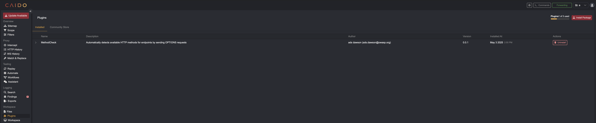

# MethodCheck

<div align="center">


_MethodCheck, dig deeper_in the Proxy_

[](https://github.com/GangGreenTemperTatum/MethodCheck/network/members)
[](https://github.com/GangGreenTemperTatum/MethodCheck/issues)
[](https://github.com/GangGreenTemperTatum/MethodCheck/releases)
[](https://github.com/GangGreenTemperTatum/MethodCheck/stargazers)
[](https://github.com/caido/store/pull/24) <!-- TODO -->
[](https://github.com/GangGreenTemperTatum/MethodCheck/blob/main/LICENSE)

[Report Bug](https://github.com/GangGreenTemperTatum/MethodCheck/issues) •
[Request Feature](https://github.com/GangGreenTemperTatum/MethodCheck/issues)

<!-- TODO > MethodCheck is now available via the Caido Plugin Library! 🥳 -->
MethodCheck has been [submitted to the Caido Plugin Library](https://github.com/caido/store/pull/24) and is currently under review. Once approved, it will be available for installation directly from the Caido interface. In the meantime, you can still install it manually by following the instructions below.

</div>

---

# Table of Contents

- [MethodCheck](#methodcheck)
- [Table of Contents](#table-of-contents)
  - [Overview](#overview)
  - [Example Usage](#example-usage)
    - [MethodCheck in Action](#methodcheck-in-action)
    - [Console Logging](#console-logging)
  - [Installation  / Loading the extension](#installation---loading-the-extension)
    - [Regular Installation](#regular-installation)
    - [Local Development](#local-development)
    - [Troubleshooting](#troubleshooting)
  - [Contributing and Supporting](#contributing-and-supporting)
    - [Star History](#star-history)


## Overview

MethodCheck is a Caido extension written in TypeScript that automatically detects available HTTP methods for endpoints by sending `OPTIONS` requests. When additional methods are found beyond the one used in the original request, the plugin creates findings and adds metadata to help identify potential security issues.

__This is a similar approach to one of my go to BAPPs, '[HTTP Methods Discloser](https://portswigger.net/bappstore/2d84c07f3a8d4e2b97828cd0aa814b07)' which is awesome and lightweight for recon and general fingerprinting.__

When an HTTP request passes through Caido's proxy (not limited to in-scope), the plugin:

- Checks if the request has already been processed (to avoid duplicates)
- Skips `OPTIONS requests` (to avoid recursive checks)
- Sends an `OPTIONS` request to the same URL
- Examines both `Allow` and `Access-Control-Allow-Methods` headers in the response
- When additional HTTP methods are found (beyond the original method used):
  - Highlights the findings incrementally, making it easily visible there are new findings available
  - Creates a finding with details about the available methods

The plugin also:

- Registers a context menu item in the HTTP request view
- Provides a dedicated plugin panel in the Caido interface
- Supports manual checking of requests via the context menu
- Logs detailed information about its operations to the console

Due to current SDK limitations, the plugin does not support the following features which are planned for future releases if made available:

- **Highlighted requests**: The plugin does not highlight requests that have been checked for additional methods.
- **Custom Columns**: The plugin does not add custom columns to the Proxy > HTTP History request table to display additional methods.
- **Tagging/Commenting**: The plugin does not tag requests with the `method-check` tag or comment on the existing requests in the HTTP History table.

---

## Example Usage

### MethodCheck in Action


*MethodCheck live findings updates notification*


*MethodCheck first registers a test finding for verification the plugin install was successful*


*MethodCheck finds additional HTTP methods for the request*

### Console Logging

MethodCheck is designed to work seamlessly in the background, automatically checking for additional HTTP methods as requests pass through the proxy. It logs its actions in the Caido backend [SDK console](https://developer.caido.io/reference/modules/extra/console.html#extra-console), providing detailed information about the requests and responses it processes, available via the [data folder](https://docs.caido.io/reference/internal_files.html):

| OS      | Location                                             |
|---------|------------------------------------------------------|
| Linux   | `~/.local/share/caido`                               |
| macOS   | `~/Library/Application\ Support/io.caido.Caido/`     |
| Windows | `%APPDATA%\caido\Caido\data`                         |

> 💡 To view logs in real-time:
>
> ```bash
> tail -f <path_to_log_file>
> ```

```bash
2025-05-03T18:57:20.473691Z  INFO plugin:96df3f13-9280-438e-8cc3-b01b5a4e957f js|sdk: [MethodCheck] Checking methods for request 11206
2025-05-03T18:57:20.473702Z  INFO plugin:96df3f13-9280-438e-8cc3-b01b5a4e957f js|sdk: [MethodCheck] Checking methods for URL: https://sync-1-us-west1-g.sync.services.mozilla.com/1.5/170298185/info/collections (original method: GET)
2025-05-03T18:57:20.473809Z  INFO plugin:96df3f13-9280-438e-8cc3-b01b5a4e957f js|sdk: [MethodCheck] Parsing URL: https://sync-1-us-west1-g.sync.services.mozilla.com/1.5/170298185/info/collections
2025-05-03T18:57:20.473829Z  INFO plugin:96df3f13-9280-438e-8cc3-b01b5a4e957f js|sdk: [MethodCheck] Parsed URL - Host: sync-1-us-west1-g.sync.services.mozilla.com, Path: /1.5/170298185/info/collections
2025-05-03T18:57:20.475352Z  INFO plugin:96df3f13-9280-438e-8cc3-b01b5a4e957f js|sdk: [MethodCheck] Created OPTIONS request to sync-1-us-west1-g.sync.services.mozilla.com:443/
2025-05-03T18:57:20.475392Z  INFO plugin:96df3f13-9280-438e-8cc3-b01b5a4e957f js|sdk: [MethodCheck] Request headers: {"User-Agent":["Caido MethodCheck"],"Host":["sync-1-us-west1-g.sync.services.mozilla.com"]}
2025-05-03T18:57:20.475397Z  INFO plugin:96df3f13-9280-438e-8cc3-b01b5a4e957f js|sdk: [MethodCheck] Sending OPTIONS request...
2025-05-03T18:57:20.568789Z  INFO plugin:96df3f13-9280-438e-8cc3-b01b5a4e957f js|sdk: [MethodCheck] OPTIONS request sent with ID: 11208
2025-05-03T18:57:20.568820Z  INFO plugin:96df3f13-9280-438e-8cc3-b01b5a4e957f js|sdk: [MethodCheck] OPTIONS response received, status: 204
2025-05-03T18:57:20.569019Z  INFO plugin:96df3f13-9280-438e-8cc3-b01b5a4e957f js|sdk: [MethodCheck] Response headers: {"Server":["openresty/1.15.8.2"],"Date":["Sat, 03 May 2025 18:57:20 GMT"],"Content-Length":["0"],"Via":["1.1 google"],"Access-Control-Max-Age":["1728000"],"Content-Type":["text/plain charset=UTF-8"],"Alt-Svc":["clear"],"Access-Control-Allow-Credentials":["true"],"Access-Control-Allow-Methods":["DELETE, GET, POST, PUT, OPTIONS"],"Access-Control-Allow-Headers":["DNT,Keep-Alive,User-Agent,X-Requested-With,If-Modified-Since,Cache-Control,Content-Type,Authorization,X-Conditions-Accepted"]}
2025-05-03T18:57:20.569040Z  INFO plugin:96df3f13-9280-438e-8cc3-b01b5a4e957f js|sdk: [MethodCheck] No Allow header found
2025-05-03T18:57:20.569046Z  INFO plugin:96df3f13-9280-438e-8cc3-b01b5a4e957f js|sdk: [MethodCheck] Found Access-Control-Allow-Methods header: DELETE
2025-05-03T18:57:20.569076Z  INFO plugin:96df3f13-9280-438e-8cc3-b01b5a4e957f js|sdk: [MethodCheck] Parsed methods from CORS header: ["DELETE"]
2025-05-03T18:57:20.569097Z  INFO plugin:96df3f13-9280-438e-8cc3-b01b5a4e957f js|sdk: [MethodCheck] Found 1 additional methods: ["DELETE"]
2025-05-03T18:57:20.569122Z  INFO plugin:96df3f13-9280-438e-8cc3-b01b5a4e957f js|sdk: [MethodCheck] Found additional methods for https://sync-1-us-west1-g.sync.services.mozilla.com/1.5/170298185/info/collections: DELETE
2025-05-03T18:57:20.569149Z  INFO plugin:96df3f13-9280-438e-8cc3-b01b5a4e957f js|sdk: [MethodCheck] Creating new finding for https://sync-1-us-west1-g.sync.services.mozilla.com/1.5/170298185/info/collections
2025-05-03T18:57:20.569997Z  INFO plugin:96df3f13-9280-438e-8cc3-b01b5a4e957f js|sdk: [MethodCheck] Successfully created finding for alternative methods on https://sync-1-us-west1-g.sync.services.mozilla.com/1.5/170298185/info/collections
```

---

## Installation  / Loading the extension

### Regular Installation

1. Open Caido, navigate to the Plugins sidebar page and then to the Community Store tab
2. Find MethodCheck and click Install
3. Done! 🎉

### Local Development

Ensure you have the following installed:
- [Node.js](https://nodejs.org/en) (Version 18+ or 20+)
- [pnpm](https://pnpm.io/) as package manager

**Additional**: For creating a new plugin with a VueJS frontend:

- [TypeScript](https://www.typescriptlang.org/)
- [VueJS](https://vuejs.org/)
- [PrimeVue](https://primevue.org/) for UI components

Run the following command to install dependencies:

From inside the package directory, run the following command to install the project dependencies:

```bash
pnpm install
```

Finally, run the following command to build your plugin into a dist/`plugin_package.zip` file:

```bash
pnpm build
```

### Troubleshooting

If you encounter any issues during the build process, try the following:

Clear the pnpm cache:

```bash
# Remove output directories
rm -rf ./dist
rm -rf ./packages/frontend/dist

# Clear TypeScript's cache
find . -name "*.tsbuildinfo" -delete
```

```bash
DEBUG=* pnpm build
```

---

## Contributing and Supporting

1. Fork the repository
2. Create your feature branch (`git checkout -b feature/amazing-feature`)
3. Commit your changes (`git commit -m 'Add some amazing feature'`)
4. Push to the branch (`git push origin feature/amazing-feature`)
5. Open a Pull Request

<br>

[](https://github.com/GangGreenTemperTatum/MethodCheck/stargazers/)

### Star History

[](https://star-history.com/#GangGreenTemperTatum/MethodCheck&Date)

---
